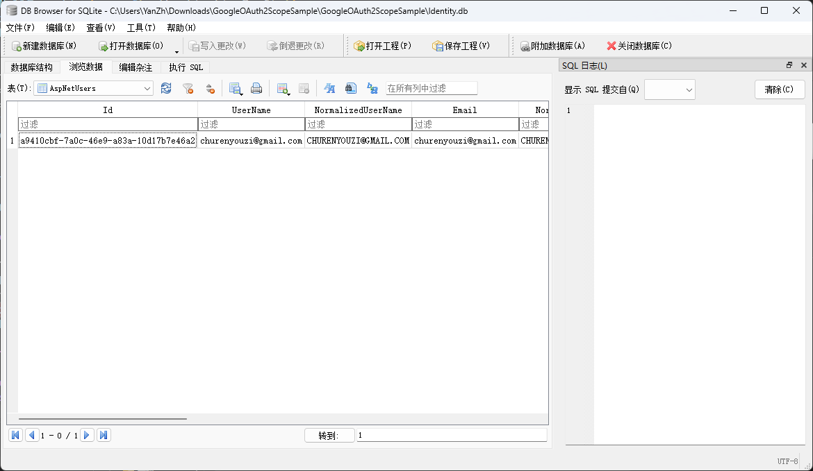
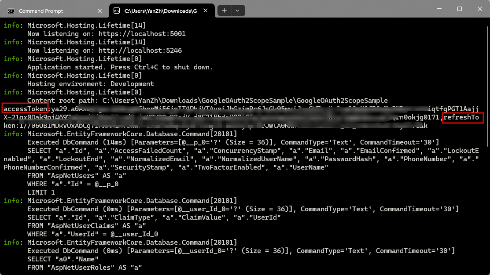
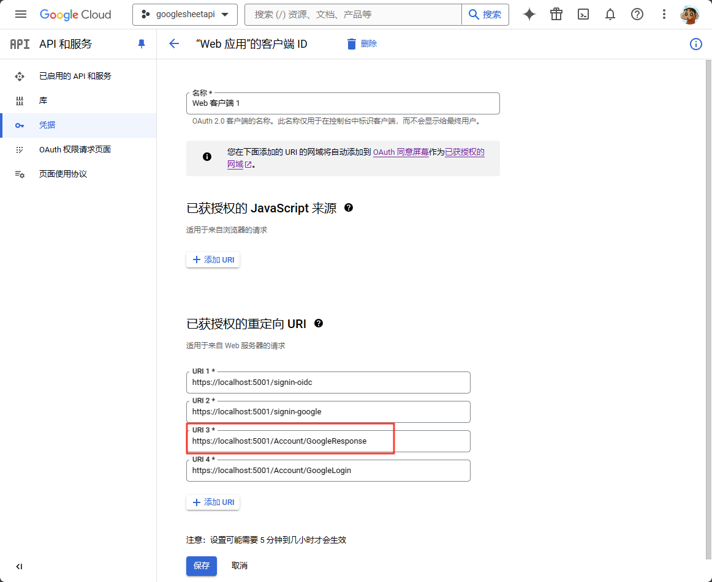

# Asp.Net Core 8 Google Authentication 示例

此仓库展示了如何在Asp.Net Core 8应用程序中集成Google身份验证，以获取`accessToken`和`refreshToken`。

## 功能特性

- 与Google OAuth 2.0集成，实现安全的用户体验验证。
- 设置Scope，获取accessToken，refreshToken从而访问操作譬如Google Sheets服务等

## 先决条件

- 安装.NET SDK 8.0或更高版本。
- 对OAuth 2.0和OpenID Connect协议有一定了解。

## 功能演示

<figure class="video_container">
  <video controls="true" allowfullscreen="true" poster="IMAGE_URL">
    <source src="screenshots/demo.mp4" type="video/mp4">
    Your browser does not support the video tag.
  </video>
</figure>




## 快速开始

1. **克隆仓库**
   
   ```bash
   git clone https://github.com/YanZhiwei/GoogleOAuth2ScopeSample.git
   ```

2. **安装依赖**
   
   `cd GoogleOAuth2ScopeSample dotnet restore`

3. **配置Google OAuth 2.0客户端ID**
   
   - 在Google开发者控制台中创建一个项目，并启用OAuth 2.0。
     
     
   
   - 按照Google的指南配置OAuth 2.0客户端ID和密钥。
   
   - 在应用程序配置文件中设置您的`ClientId`和`ClientSecret`。
     
     ```
     "Authentication": {
       "Google": {
         "ClientId": "YOUR_GOOGLE_CLIENT_ID",
         "ClientSecret": "YOUR_GOOGLE_CLIENT_SECRET"
       }
     }
     ```

4. **运行应用程序**
   
   `dotnet run`